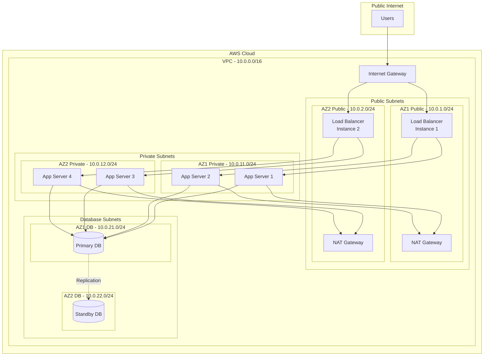
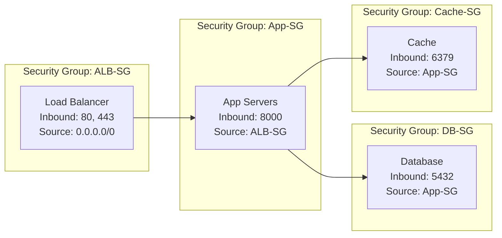

# Network and Infrastructure Diagram

## Network Architecture

```mermaid
graph TB
    subgraph "Public Internet"
        Users[Users]
    end
    
    subgraph "AWS Cloud"
        subgraph "VPC - 10.0.0.0/16"
            subgraph "Public Subnets"
                subgraph "AZ1 Public - 10.0.1.0/24"
                    NAT1[NAT Gateway]
                    ALB1[Load Balancer<br/>Instance 1]
                end
                
                subgraph "AZ2 Public - 10.0.2.0/24"
                    NAT2[NAT Gateway]
                    ALB2[Load Balancer<br/>Instance 2]
                end
            end
            
            subgraph "Private Subnets"
                subgraph "AZ1 Private - 10.0.11.0/24"
                    App1[App Server 1]
                    App2[App Server 2]
                end
                
                subgraph "AZ2 Private - 10.0.12.0/24"
                    App3[App Server 3]
                    App4[App Server 4]
                end
            end
            
            subgraph "Database Subnets"
                subgraph "AZ1 DB - 10.0.21.0/24"
                    DB1[(Primary DB)]
                end
                
                subgraph "AZ2 DB - 10.0.22.0/24"
                    DB2[(Standby DB)]
                end
            end
            
            IGW[Internet Gateway]
        end
    end
    
    Users --> IGW
    IGW --> ALB1 & ALB2
    ALB1 --> App1 & App2
    ALB2 --> App3 & App4
    App1 & App2 --> NAT1
    App3 & App4 --> NAT2
    App1 & App2 & App3 & App4 --> DB1
    DB1 -.Replication.-> DB2
```

## Security Groups

```mermaid
graph LR
    subgraph "Security Group: ALB-SG"
        ALB[Load Balancer<br/>Inbound: 80, 443<br/>Source: 0.0.0.0/0]
    end
    
    subgraph "Security Group: App-SG"
        AppServers[App Servers<br/>Inbound: 8000<br/>Source: ALB-SG]
    end
    
    subgraph "Security Group: DB-SG"
        Database[Database<br/>Inbound: 5432<br/>Source: App-SG]
    end
    
    subgraph "Security Group: Cache-SG"
        Cache[Cache<br/>Inbound: 6379<br/>Source: App-SG]
    end
    
    ALB --> AppServers
    AppServers --> Database
    AppServers --> Cache
```
