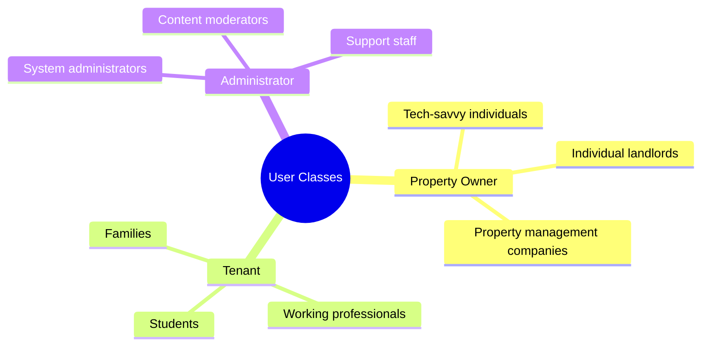
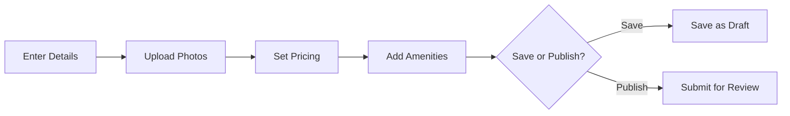
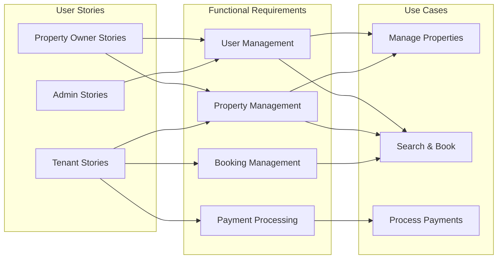

# Requirements Document - MeroGhar Rental Platform

## 1. Introduction

### 1.1 Purpose
This document specifies the functional and non-functional requirements for the MeroGhar rental property management platform. MeroGhar aims to connect property owners with potential tenants, streamlining the rental process in Nepal.

### 1.2 Scope
The platform will facilitate property listing, search, booking, payment processing, and tenant-owner communication. It will serve property owners, tenants, and administrators.

### 1.3 Definitions and Acronyms
- **Owner**: Property owner who lists properties for rent
- **Tenant**: User searching for and renting properties
- **Admin**: Platform administrator
- **API**: Application Programming Interface
- **UI**: User Interface
- **SLA**: Service Level Agreement

## 2. Overall Description

### 2.1 Product Perspective
MeroGhar is a web and mobile platform that serves as a marketplace for rental properties. It integrates with payment gateways, notification services, and cloud storage.

### 2.2 Product Functions
- User registration and authentication
- Property listing management
- Property search and filtering
- Booking and reservation system
- Payment processing
- Review and rating system
- Maintenance request management
- Notification system

### 2.3 User Classes and Characteristics

## 3. Functional Requirements

### 3.1 User Management

#### FR-UM-001: User Registration
**Priority**: High  
**Description**: Users must be able to register with email and password  
**Acceptance Criteria**:
- Email validation required
- Password strength requirements enforced
- Email verification link sent
- User profile created upon verification

#### FR-UM-002: User Authentication
**Priority**: High  
**Description**: Users must be able to log in securely  
**Acceptance Criteria**:
- Support email/password login
- JWT token-based authentication
- Session management
- Password reset functionality

#### FR-UM-003: Profile Management
**Priority**: Medium  
**Description**: Users can manage their profile information  
**Acceptance Criteria**:
- Update personal information
- Upload profile picture
- Add contact details
- Update preferences

### 3.2 Property Management

#### FR-PM-001: Create Property Listing
**Priority**: High  
**Description**: Property owners can create new property listings  
**Acceptance Criteria**:
- Input property details (title, description, location)
- Set pricing information
- Upload multiple photos (minimum 3)
- Specify amenities and features
- Save as draft or submit for review

#### FR-PM-002: Edit Property Listing
**Priority**: High  
**Description**: Owners can modify existing property listings  
**Acceptance Criteria**:
- Update any property field
- Add/remove photos
- Change pricing
- Modify availability

#### FR-PM-003: Property Search
**Priority**: High  
**Description**: Users can search for properties  
**Acceptance Criteria**:
- Filter by location
- Filter by price range
- Filter by property type
- Filter by amenities
- Sort results by price, date, rating
- Display results with pagination

#### FR-PM-004: Property Details View
**Priority**: High  
**Description**: Users can view detailed property information  
**Acceptance Criteria**:
- Display all property information
- Show image gallery
- Display location on map
- Show amenities list
- Display reviews and ratings
- Show availability calendar

### 3.3 Booking Management

#### FR-BM-001: Create Booking Request
**Priority**: High  
**Description**: Tenants can request to book a property  
**Acceptance Criteria**:
- Select start and end dates
- View total cost calculation
- Add booking notes
- Submit booking request
- Receive confirmation email

#### FR-BM-002: Approve/Reject Booking
**Priority**: High  
**Description**: Owners can approve or reject booking requests  
**Acceptance Criteria**:
- View booking details
- Accept booking request
- Reject with reason
- Send notification to tenant

#### FR-BM-003: Booking Status Tracking
**Priority**: Medium  
**Description**: Users can track booking status  
**Acceptance Criteria**:
- View all bookings (as owner or tenant)
- Filter by status
- View booking timeline
- Receive status updates

### 3.4 Payment Processing

#### FR-PP-001: Process Payment
**Priority**: High  
**Description**: System processes rental payments  
**Acceptance Criteria**:
- Support multiple payment methods (eSewa, Khalti, Bank)
- Generate payment invoice
- Process payment via gateway
- Confirm payment success/failure
- Send payment receipt

#### FR-PP-002: Payment History
**Priority**: Medium  
**Description**: Users can view payment history  
**Acceptance Criteria**:
- List all transactions
- Filter by date range
- Download receipts
- View payment status

### 3.5 Review and Rating System

#### FR-RR-001: Submit Review
**Priority**: Medium  
**Description**: Tenants can review properties after stay  
**Acceptance Criteria**:
- Rate property (1-5 stars)
- Write text review
- Submit only after booking completion
- Edit review within 7 days

#### FR-RR-002: View Reviews
**Priority**: Medium  
**Description**: Display property reviews  
**Acceptance Criteria**:
- Show average rating
- Display all reviews
- Sort by date or rating
- Mark verified bookings

### 3.6 Maintenance Requests

#### FR-MR-001: Create Maintenance Request
**Priority**: Medium  
**Description**: Tenants can report maintenance issues  
**Acceptance Criteria**:
- Describe issue
- Upload photos
- Set priority level
- Submit request

#### FR-MR-002: Manage Maintenance Requests
**Priority**: Medium  
**Description**: Owners can manage maintenance requests  
**Acceptance Criteria**:
- View all requests
- Acknowledge request
- Assign to service provider
- Mark as completed
- Close request

### 3.7 Notifications

#### FR-NT-001: Email Notifications
**Priority**: High  
**Description**: System sends email notifications  
**Events**:
- New user registration
- Booking request received
- Booking approved/rejected
- Payment confirmation
- Maintenance request updates

#### FR-NT-002: In-App Notifications
**Priority**: Medium  
**Description**: Users receive in-app notifications  
**Acceptance Criteria**:
- Real-time notifications
- Mark as read/unread
- Notification history
- Notification preferences

## 4. Non-Functional Requirements

### 4.1 Performance Requirements

#### NFR-PF-001: Response Time
**Requirement**: 95% of API requests must respond within 500ms  
**Measurement**: Server-side response time monitoring

#### NFR-PF-002: Page Load Time
**Requirement**: Pages must load within 2 seconds on 4G connection  
**Measurement**: Lighthouse performance score > 90

#### NFR-PF-003: Concurrent Users
**Requirement**: Support 10,000 concurrent users  
**Measurement**: Load testing verification

### 4.2 Security Requirements

#### NFR-SC-001: Data Encryption
**Requirement**: All data in transit must use TLS 1.3  
**Implementation**: HTTPS for all communications

#### NFR-SC-002: Password Security
**Requirement**: Passwords must be hashed using bcrypt  
**Implementation**: Minimum 10 rounds hashing

#### NFR-SC-003: Authentication
**Requirement**: Implement JWT-based authentication  
**Implementation**: Token expiration after 24 hours

#### NFR-SC-004: Authorization
**Requirement**: Role-based access control (RBAC)  
**Implementation**: Verify permissions on every request

#### NFR-SC-005: Data Privacy
**Requirement**: Comply with data protection regulations  
**Implementation**: User data encryption at rest

### 4.3 Reliability Requirements

#### NFR-RL-001: Availability
**Requirement**: 99.9% uptime (SLA)  
**Measurement**: Maximum 8.76 hours downtime per year

#### NFR-RL-002: Data Backup
**Requirement**: Daily automated backups  
**Implementation**: Retain backups for 30 days

#### NFR-RL-003: Disaster Recovery
**Requirement**: Recovery Time Objective (RTO) < 4 hours  
**Implementation**: Multi-region deployment

### 4.4 Scalability Requirements

#### NFR-SL-001: Horizontal Scaling
**Requirement**: System must support horizontal scaling  
**Implementation**: Stateless application servers

#### NFR-SL-002: Database Scaling
**Requirement**: Support read replicas for scaling  
**Implementation**: Master-slave replication

#### NFR-SL-003: Storage Scaling
**Requirement**: Cloud storage for unlimited file uploads  
**Implementation**: AWS S3 or equivalent

### 4.5 Usability Requirements

#### NFR-US-001: Browser Compatibility
**Requirement**: Support latest 2 versions of major browsers  
**Browsers**: Chrome, Firefox, Safari, Edge

#### NFR-US-002: Mobile Responsiveness
**Requirement**: Fully responsive design  
**Testing**: Works on devices from 320px to 2560px width

#### NFR-US-003: Accessibility
**Requirement**: WCAG 2.1 Level AA compliance  
**Implementation**: Proper ARIA labels, keyboard navigation

#### NFR-US-004: Internationalization
**Requirement**: Support English and Nepali languages  
**Implementation**: i18n framework integration

### 4.6 Maintainability Requirements

#### NFR-MT-001: Code Documentation
**Requirement**: All public APIs must be documented  
**Tool**: Swagger/OpenAPI specification

#### NFR-MT-002: Code Quality
**Requirement**: Maintain code quality standards  
**Metrics**: Test coverage > 80%, no critical issues

#### NFR-MT-003: Logging
**Requirement**: Comprehensive application logging  
**Implementation**: Structured logging with log levels

## 5. System Constraints

### 5.1 Technical Constraints
- Must use PostgreSQL database
- Must integrate with Nepali payment gateways (eSewa, Khalti)
- Must deploy on AWS or compatible cloud provider
- Must support mobile devices (responsive web + native app)

### 5.2 Business Constraints
- Platform commission: 5-10% per transaction
- Free tier for basic listings
- Premium features for paid subscriptions
- Compliance with local rental laws

### 5.3 Regulatory Constraints
- Data protection and privacy laws
- Financial transaction regulations
- Consumer protection laws
- Property rental regulations

## 6. Requirements Traceability Matrix

## 7. Assumptions and Dependencies

### 7.1 Assumptions
- Users have internet access
- Users have valid email addresses
- Users have access to supported payment methods
- Property owners have legal right to rent properties

### 7.2 Dependencies
- Payment gateway APIs (eSewa, Khalti)
- Email service provider (SMTP)
- SMS gateway service
- Cloud storage provider
- Google Maps API
- SSL certificate provider

## 8. Appendices

### 8.1 Glossary
- **Booking**: A reservation request for a property
- **Listing**: A property advertisement created by owner
- **Amenity**: A facility or feature available in a property
- **Commission**: Platform fee charged on transactions

### 8.2 References
- User Stories Document
- Use Case Specifications
- API Documentation
- Database Schema
