# User Stories

## Epic: Property Management System

### Property Owner Stories

**US-001: List Property**
```
As a property owner
I want to create property listings
So that I can rent out my properties to tenants
```

**US-002: Manage Bookings**
```
As a property owner
I want to manage booking requests
So that I can accept or reject potential tenants
```

**US-003: View Analytics**
```
As a property owner
I want to view property performance analytics
So that I can make informed decisions about my rentals
```

### Tenant Stories

**US-004: Search Properties**
```
As a tenant
I want to search for available properties
So that I can find a suitable place to rent
```

**US-005: Book Property**
```
As a tenant
I want to book a property
So that I can secure my rental
```

**US-006: Make Payments**
```
As a tenant
I want to make rental payments online
So that I can pay rent conveniently
```

### Admin Stories

**US-007: Manage Users**
```
As an admin
I want to manage user accounts
So that I can maintain platform integrity
```

**US-008: Moderate Listings**
```
As an admin
I want to moderate property listings
So that I can ensure quality and compliance
```

## User Story Map

```mermaid
graph TB
    subgraph "Property Owner Journey"
    PO1[Register Account] --> PO2[Create Listing]
    PO2 --> PO3[Upload Photos]
    PO3 --> PO4[Set Pricing]
    PO4 --> PO5[Publish Listing]
    PO5 --> PO6[Receive Booking Request]
    PO6 --> PO7[Review Tenant]
    PO7 --> PO8[Accept/Reject]
    PO8 --> PO9[Manage Tenancy]
    end
    
    subgraph "Tenant Journey"
    T1[Register Account] --> T2[Search Properties]
    T2 --> T3[Filter & Compare]
    T3 --> T4[View Details]
    T4 --> T5[Submit Booking Request]
    T5 --> T6[Wait for Approval]
    T6 --> T7[Make Payment]
    T7 --> T8[Move In]
    end
```


