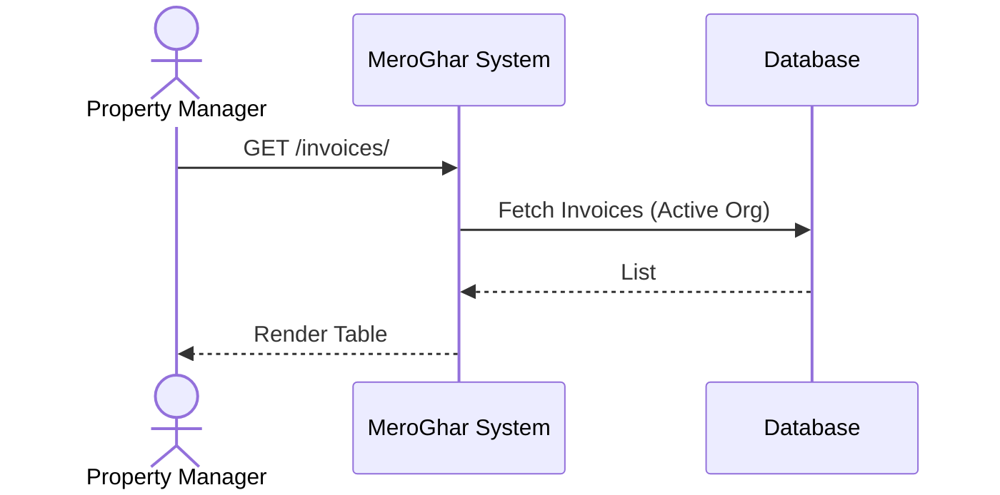
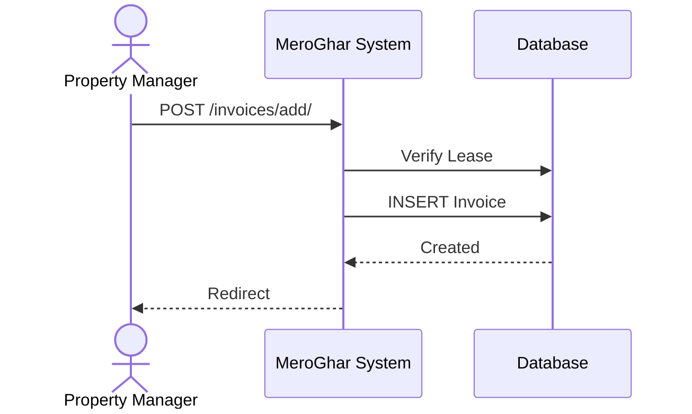
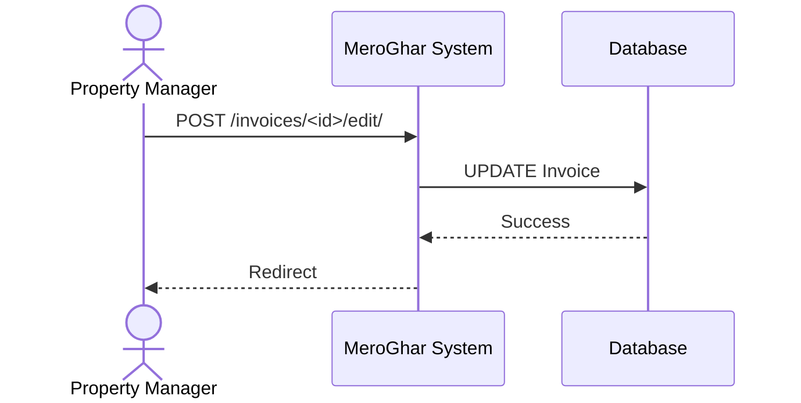

# Invoice Workflows

Workflows related to the `Invoice` model.

## 1. List Invoices

**Description**: Accessing billing history.

### Endpoint
`GET /invoices/`

### System Diagram

## 2. Generate Invoice

**Description**: Creating a new invoice.

### Endpoint
`POST /invoices/add/`

### System Diagram

## 3. Update Invoice

**Description**: Correcting an invoice.

### Endpoint
`POST /invoices/<id>/edit/`

### System Diagram

