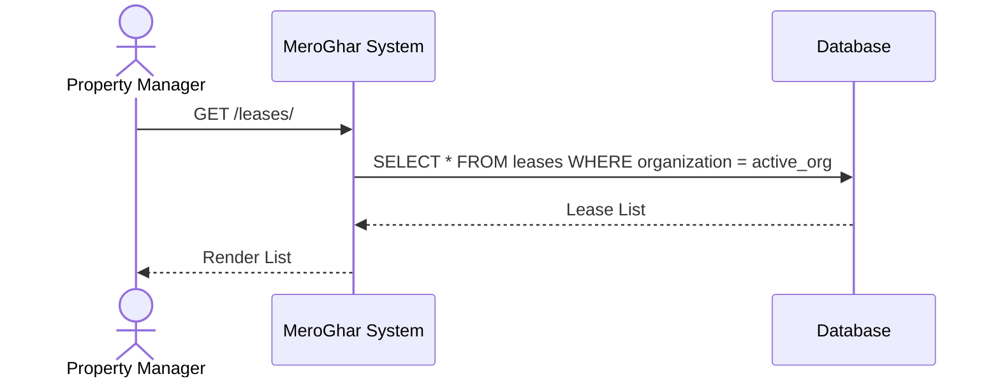
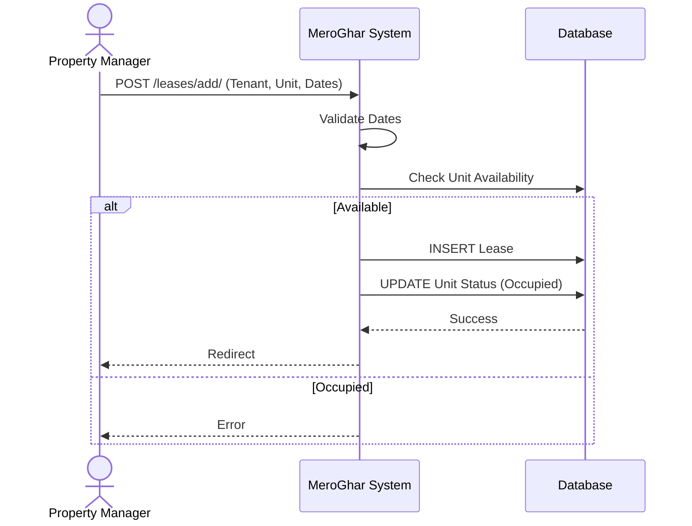
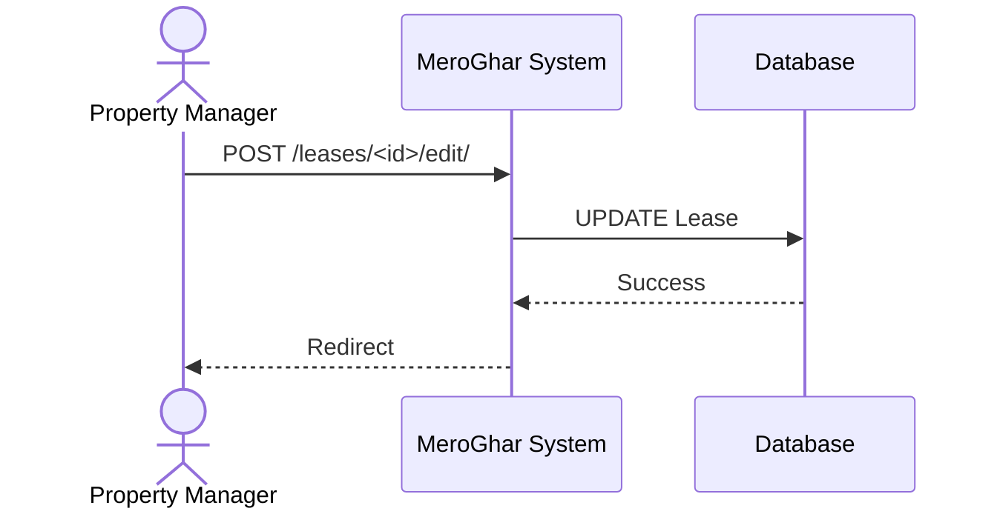
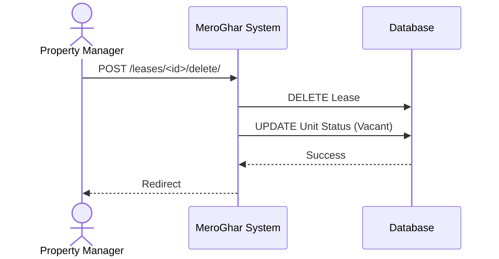

# Lease Workflows

Workflows related to the `Lease` model.

## 1. List Leases

**Description**: View all active and past leases.

### Endpoint
`GET /leases/`

### System Diagram

## 2. Create Lease

**Description**: Formalizing a rental agreement.

### Endpoint
`POST /leases/add/`

### System Diagram

## 3. Update Lease

**Description**: Extending dates or changing rent.

### Endpoint
`POST /leases/<id>/edit/`

### System Diagram

## 4. Terminate/Delete Lease

**Description**: Ending a lease early or deleting record.

### Endpoint
`POST /leases/<id>/delete/`

### System Diagram

