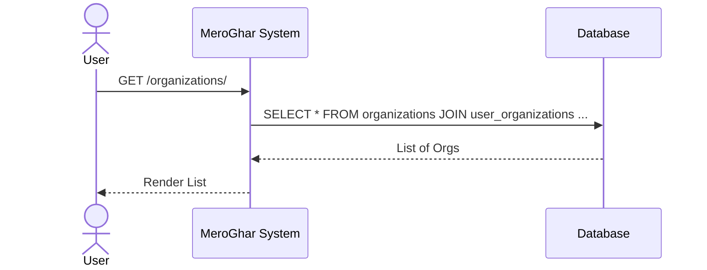
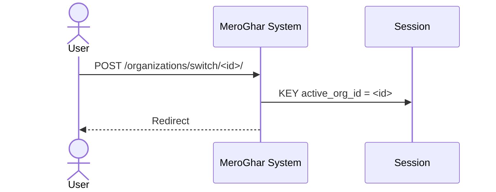
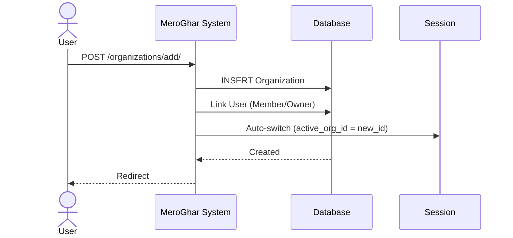
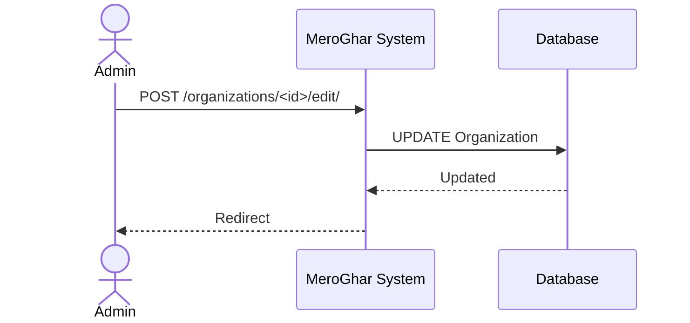

# Organization Workflows

Workflows related to the `Organization` model.

## 1. List Organizations

**Description**: View all organizations the user is a member of.

### Endpoint
`GET /organizations/`

### System Diagram

## 2. Switch Organization

**Description**: Change active context.

### Endpoint
`POST /organizations/switch/<org_id>/`

### System Diagram

## 3. Add Organization

**Description**: Create a new organization.

### Endpoint
`POST /organizations/add/`

### System Diagram

## 4. Edit Organization

**Description**: Update org details.

### Endpoint
`POST /organizations/<id>/edit/`

### System Diagram

