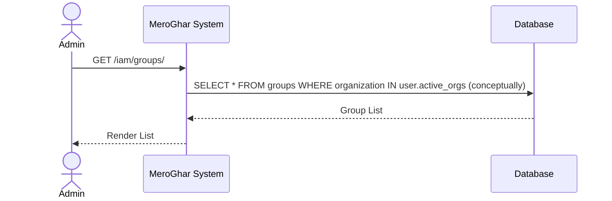
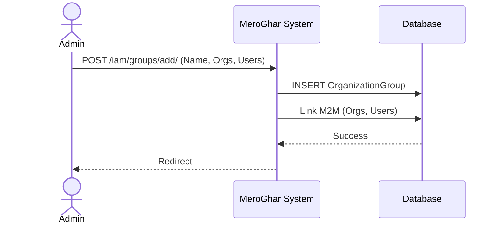
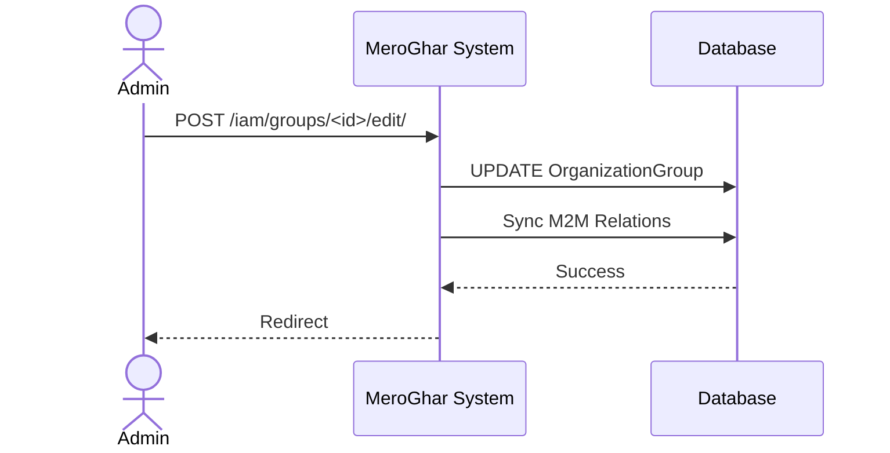
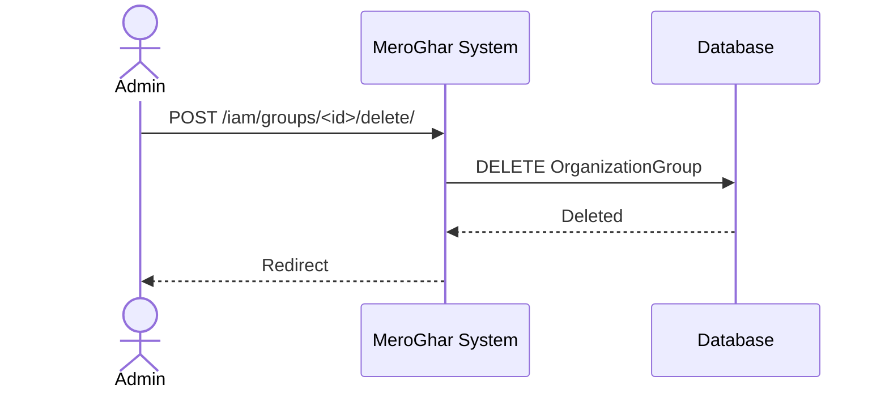

# Organization Group Workflows

Workflows related to the `OrganizationGroup` model.

## 1. List Groups

**Description**: View all groups.

### Endpoint
`GET /iam/groups/`

### System Diagram

## 2. Manage/Add Group

**Description**: Create a group.

### Endpoint
`POST /iam/groups/add/`

### System Diagram

## 3. Edit Group

**Description**: Modify members or permissions.

### Endpoint
`POST /iam/groups/<id>/edit/`

### System Diagram

## 4. Delete Group

**Description**: Remove a group.

### Endpoint
`POST /iam/groups/<id>/delete/`

### System Diagram

