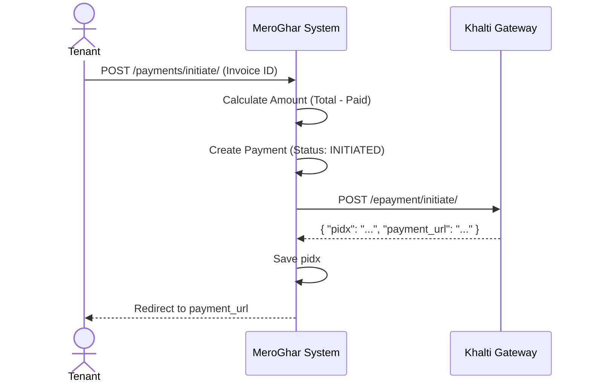
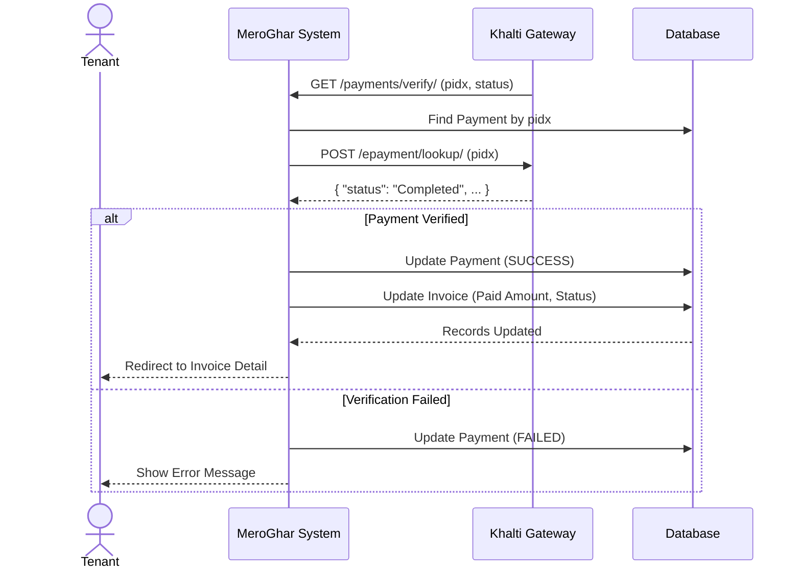

# Payment Workflows

Workflows related to the `Payment` model.

## 1. Khalti Payment

**Description**: End-to-end flow for paying an Invoice using the Khalti ePayment Gateway (v2).

### Part 1: Initiation

**Endpoint**: `POST /payments/initiate/<invoice_id>/`

1.  Tenant clicks "Pay with Khalti".
2.  System creates `Payment` (INITIATED).
3.  Calls Khalti Initiate API.
4.  Redirects to `payment_url`.

#### Initiation Diagram

### Part 2: Verification

**Endpoint**: `GET /payments/verify/`

1.  Khalti redirects back with `pidx`.
2.  System calls Khalti Lookup API.
3.  Updates Payment to SUCCESS and Invoice to PAID.

#### Verification Diagram

