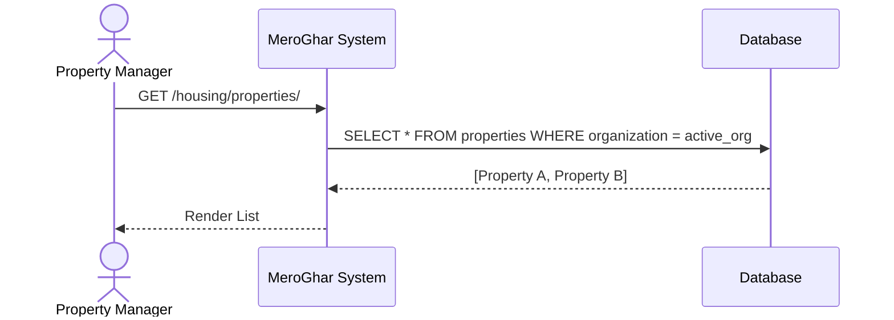
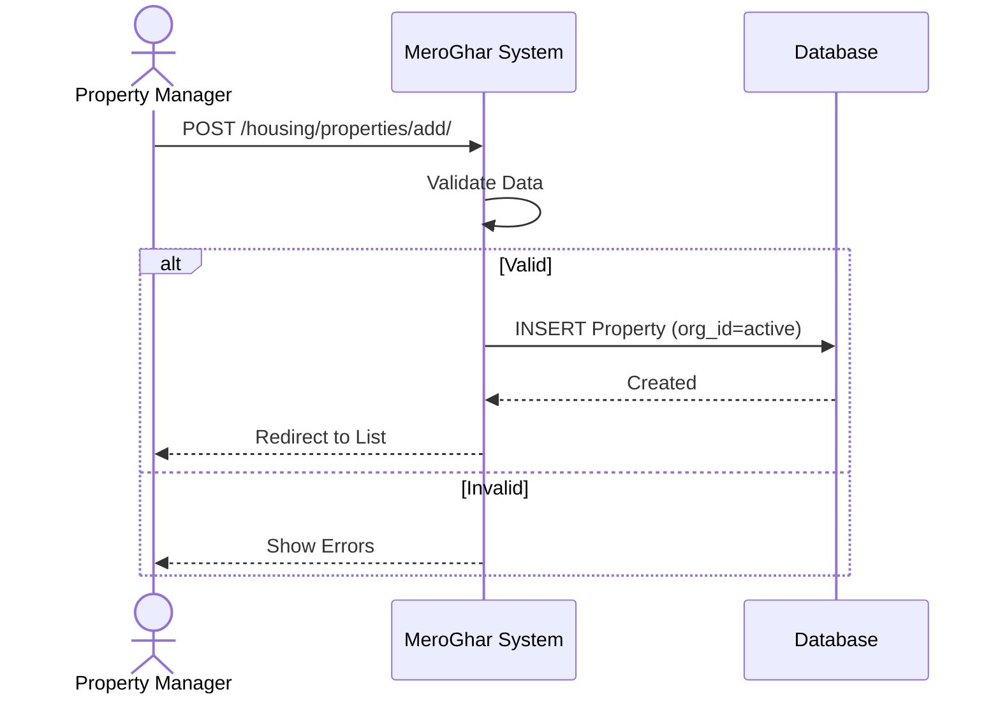
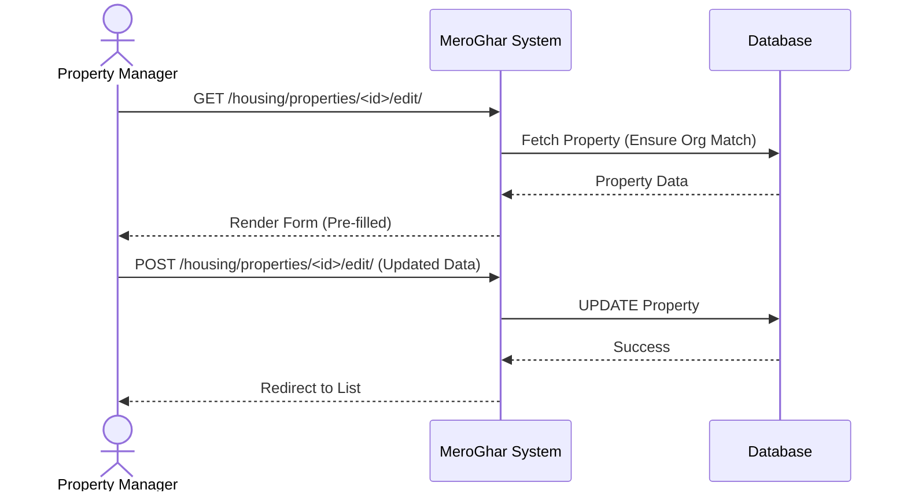
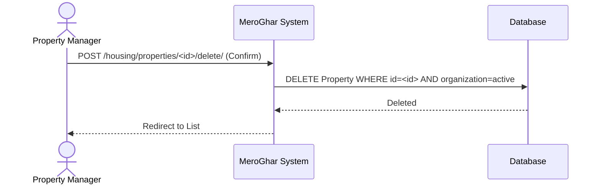

# Property Workflows

Workflows related to the `Property` model.

## 1. List Properties

**Description**: View all properties belonging to the active organization.

### Endpoint
`GET /housing/properties/`

### Logic
1.  System identifies the Active Organization from component/session.
2.  System queries database for Properties where `organization_id` matches.
3.  System renders list.

### System Diagram

## 2. Add Property

**Description**: Usage of the system to register a new real estate property.

### Endpoint
`POST /housing/properties/add/`

### Logic
1.  User submits form data.
2.  System validates data.
3.  System creates Property linked to Active Organization.

### System Diagram

## 3. Update Property

**Description**: Modifying an existing property's details.

### Endpoint
`POST /housing/properties/<id>/edit/`

### Logic
1.  User requests edit form.
2.  System verifies Property belongs to Active Organization.
3.  User submits changes.
4.  System updates record.

### System Diagram

## 4. Delete Property

**Description**: Removing a property from the system.

### Endpoint
`POST /housing/properties/<id>/delete/`

### Logic
1.  User requests delete confirmation.
2.  System verifies Ownership/Org.
3.  User confirms.
4.  System deletes record (or soft deletes).

### System Diagram

