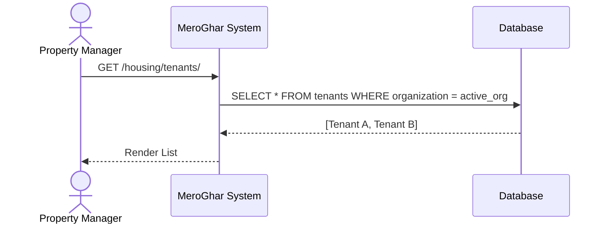
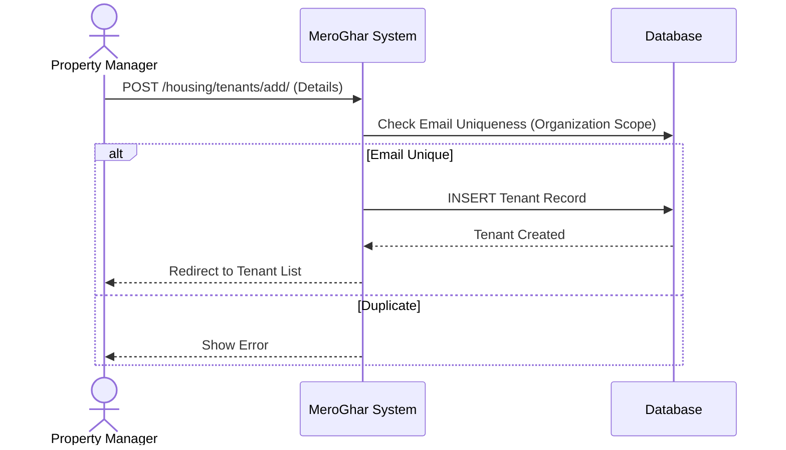
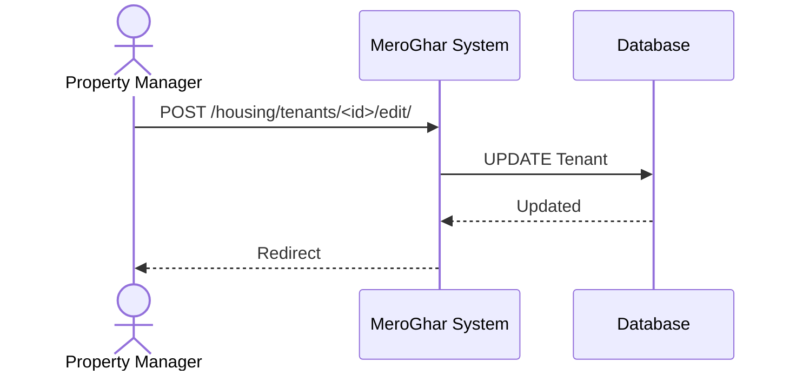
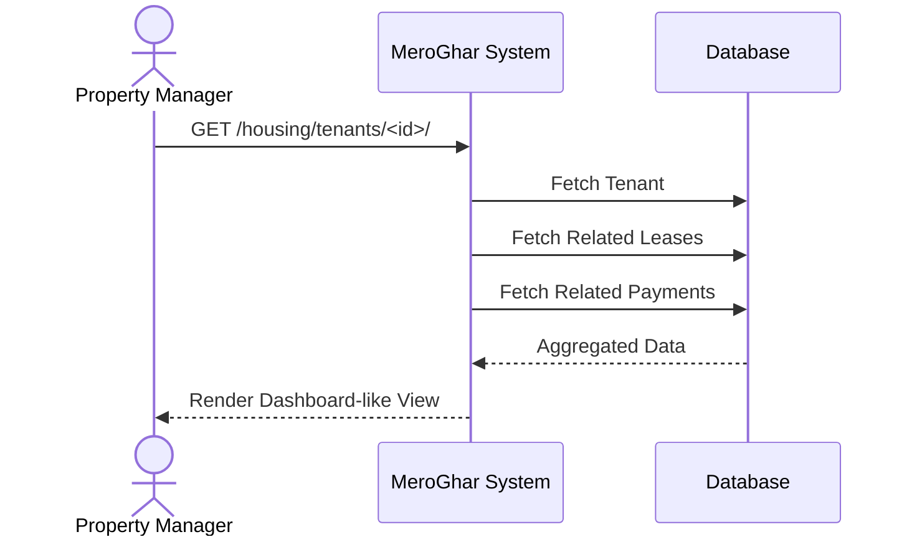

# Tenant Workflows

Workflows related to the `Tenant` model.

## 1. List Tenants

**Description**: View all tenants in the active organization.

### Endpoint
`GET /housing/tenants/`

### System Diagram

## 2. Register Tenant

**Description**: Onboarding a new tenant.

### Endpoint
`POST /housing/tenants/add/`

### System Diagram

## 3. Update Tenant

**Description**: Updating contact or personal info.

### Endpoint
`POST /housing/tenants/<id>/edit/`

### System Diagram

## 4. View Tenant Details

**Description**: Viewing full profile, leases, and payment history.

### Endpoint
`GET /housing/tenants/<id>/`

### System Diagram

