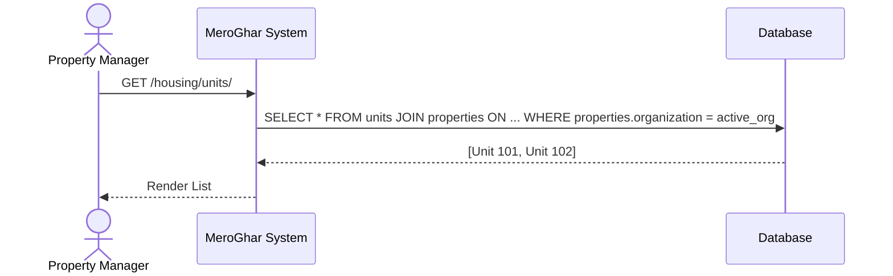
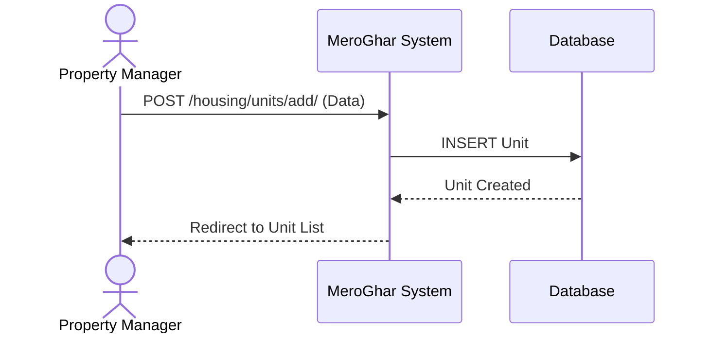
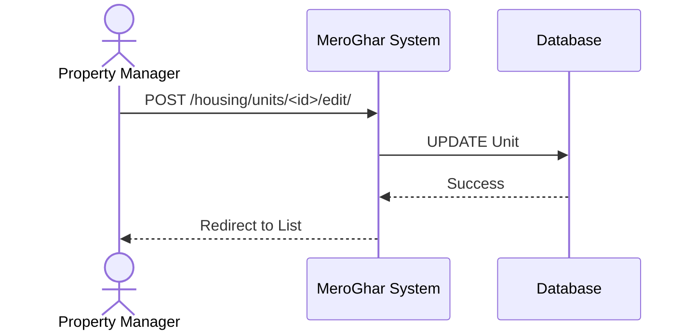
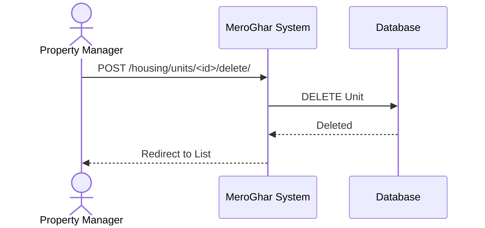

# Unit Workflows

Workflows related to the `Unit` model.

## 1. List Units

**Description**: View all units in the active organization.

### Endpoint
`GET /housing/units/`

### System Diagram

## 2. Add Unit

**Description**: Adding a unit to a property.

### Endpoint
`POST /housing/units/add/`

### System Diagram

## 3. Update Unit

**Description**: Edit unit details (rent, status, etc.).

### Endpoint
`POST /housing/units/<id>/edit/`

### System Diagram

## 4. Delete Unit

**Description**: Remove a unit. Usually restricted if active lease exists.

### Endpoint
`POST /housing/units/<id>/delete/`

### System Diagram

