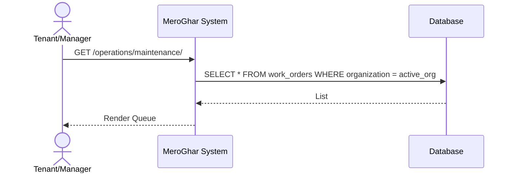
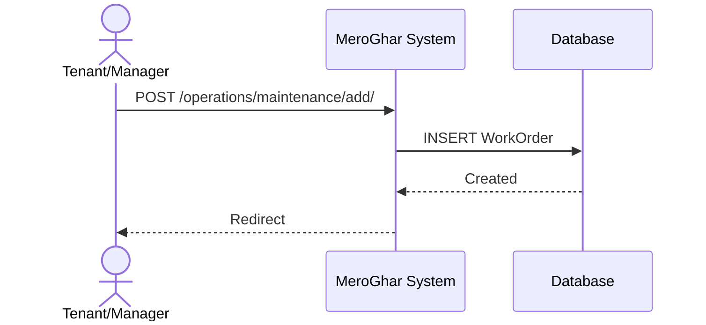
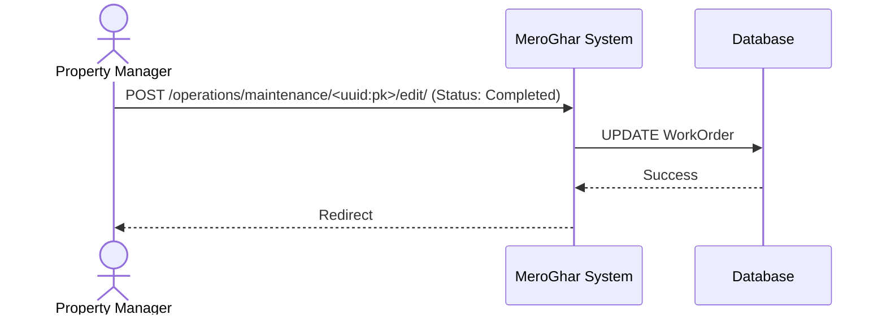

# Work Order Workflows

Workflows related to the `WorkOrder` model.

## 1. List Work Orders

**Description**: View maintenance queue.

### Endpoint
`GET /operations/maintenance/`

### System Diagram

## 2. Submit Work Order

**Description**: Create new request.

### Endpoint
`POST /operations/maintenance/add/`

### System Diagram

## 3. Update Work Order

**Description**: Update status (e.g. In Progress, Completed).

### Endpoint
`POST /operations/maintenance/<uuid:pk>/edit/`

### System Diagram

